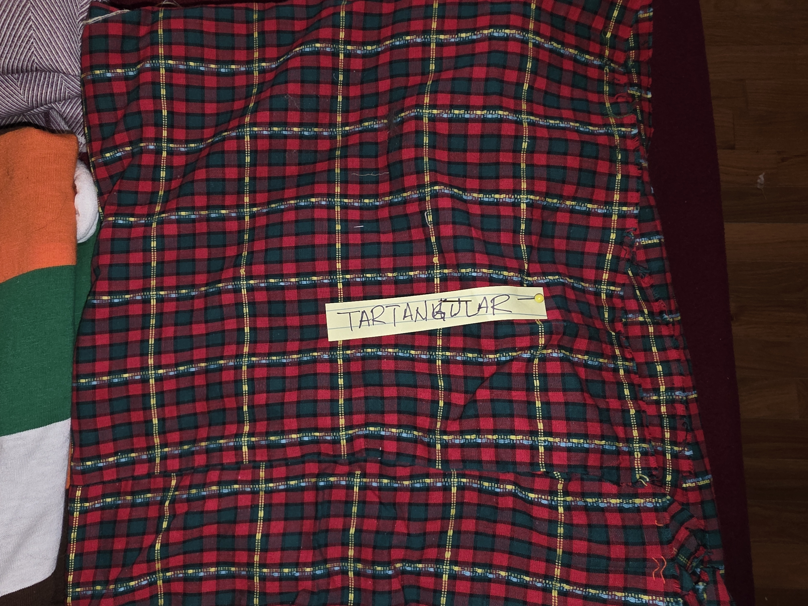
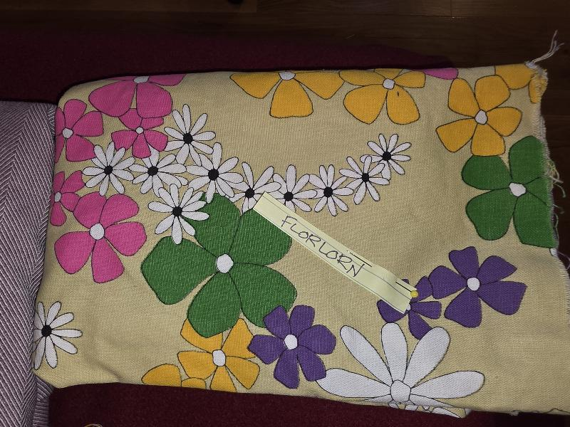
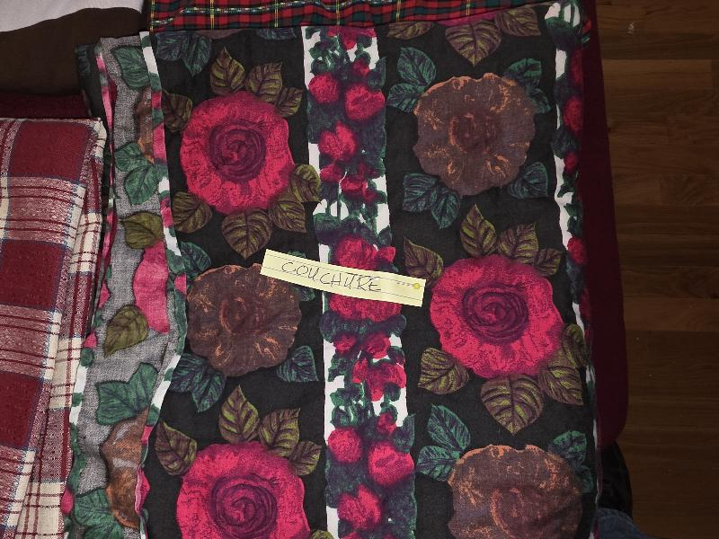
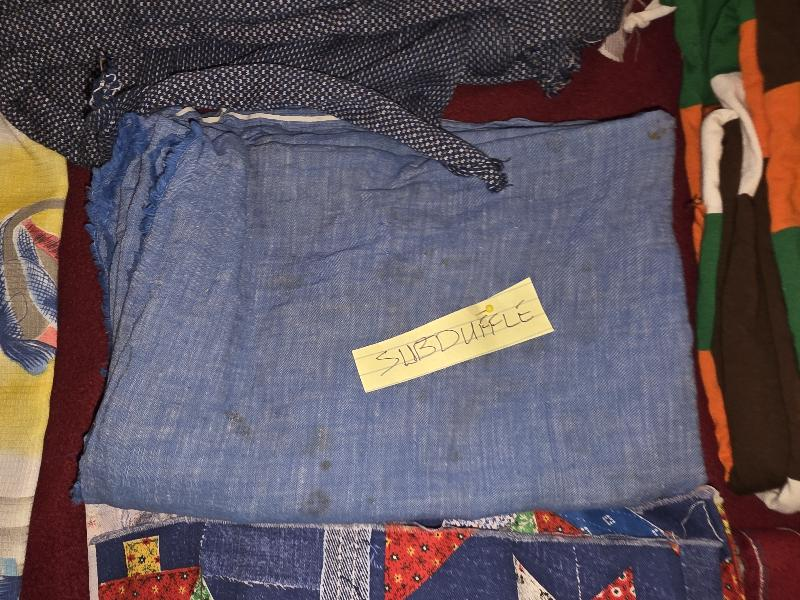
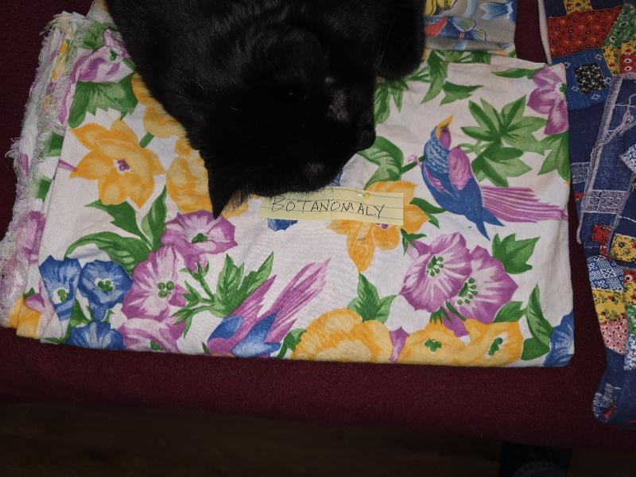

*This is a blog remniscient of John Carmack's web log that started it all.*

## Wed, Nov 5, 2025
Third weekday of my new retirement life. This week is not as productive as I'd like, mostly because the time change ("fall back") has thrown me off a bit. I'm rolling with it.

### 08:55 Still, a good start
I woke from vivid dreams I can't remember clearly, tho there was a food theme.

As always, I fed the cat and made some tea, then curled back up under the covers to write my [substack](https://williamwear.substack.com/). Today was extra productive: I wrote a note to this effect:

> Some of my posts don’t garner many views. I used to worry and look for “the formula.” Then, a few days ago, someone DM’d me about one of the weaker ones: “You always seem to know just what I need to hear when I’m depressed: this one really lifted me.” It’s humbling to be reminded why I’m doing this.

Feeling enlivened and ambitious, I penned a post completely freehand (aka, no soak time revisions), about why [you're never too old](https://open.substack.com/pub/williamwear/p/youre-never-too-old?utm_source=share&utm_medium=android&r=5l1qei).

Now I'm lying in bed still, swilling cold tea and cuddling the cat. And considering a revelation of the early waking moments: I should wait to start posting to my maker websites until I've got a little more progress in the making. Hmm.

## Thin wispy clouds, sunny and cold
The dollar-store clock on the wall regulates my heartbeat while I lie here, using the cat to excuse my laziness. A sneeze. A sigh.

Over the last two days, I've washed all my laundry, as well as half a footlocker of old sewing material I inherited from my mother-in-law. Lots of different whimsical fabrics, for which I currently have no idea. And a ton of corduroy, which gave me the idea to make theme purses, backpacks, phone cases, or even baby blankets around the designs:

* Corderroneous: Corduroy fabric daypack in a quilted pattern of odd wale angles and semi-incompatible colors.

	

* Scrummage: Rugby shirt material made into a big sling bag.

	

* Plaiditude: a boxy purse made from plaid with boxy attitude.

	

* Tartangular: an odd little purse from tartan material on a slant.

	

* Florlorn: a laptop bag using a failed attempt at a dress from floral upholstery material.

	

* Couchure: a boho crossbody bag made from fairly obnoxious faux-floral, shoulda-been-but-isn't-upholstery material.

	

* Subdueful: a small, inconspicuous purse made from, well, small, inconspicuous material.

	

* Stitchuation: a larger purse made from somebody's really weird idea of a pair of ladies pants.

	

* Aubergenius: a complete kit (phone sling, backpack, purse, et al) made from bias pinstribed aubergine material.

	

* Botanomaly: let's make a sling bag from this doesn't-quite-fit-any-category fabric print.

	

* Fishin Statement: a beach bag covered in weird-looking fish.

	

Don't worry, if this wasn't enough, there's (apparently) much more of this potluck available.

## 17:15 a decent day of sewing stuff

Other than a bit of work on the kitchen under-cabinet plugs (just gluing the modular plugs in place in the enclosures), the rest of the day so far has been spent on my coffee-themed quilt, which I'm calling "Brew-Hemian Rhapsody."  The center stripe (already sewn) is 6-inch squares.  Everything is four-inch squares,

	

with two 2"x4" rectangles moving randomly down the line to make it big enough:

	

I'm making the most of material I already have.

At the moment, I'm eating salted brown butter cookie ice cream and chilling.  Maybe more will get done later.
