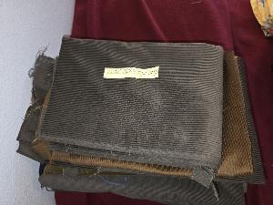
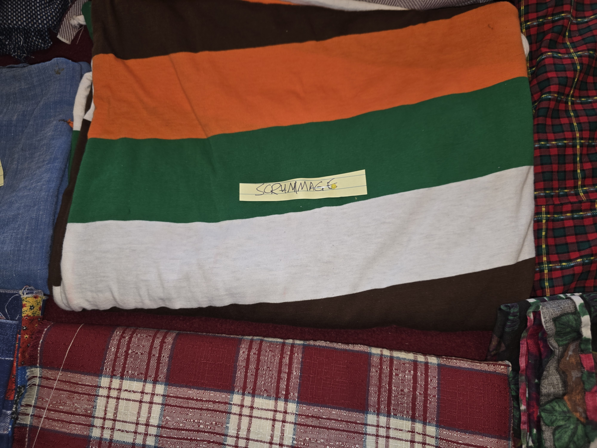

*This is a blog remniscient of John Carmack's web log that started it all.*

## Wed, Nov 5, 2025
Third weekday of my new retirement life. This week is not as productive as I'd like, mostly because the time change ("fall back") has thrown me off a bit. I'm rolling with it.

### 08:55 Still, a good start
I woke from vivid dreams I can't remember clearly, tho there was a food theme.

As always, I fed the cat and made some tea, then curled back up under the covers to write my [substack](https://williamwear.substack.com/). Today was extra productive: I wrote a note to this effect:

> Some of my posts don’t garner many views. I used to worry and look for “the formula.” Then, a few days ago, someone DM’d me about one of the weaker ones: “You always seem to know just what I need to hear when I’m depressed: this one really lifted me.” It’s humbling to be reminded why I’m doing this.

Feeling enlivened and ambitious, I penned a post completely freehand (aka, no soak time revisions), about why [you're never too old](https://open.substack.com/pub/williamwear/p/youre-never-too-old?utm_source=share&utm_medium=android&r=5l1qei).

Now I'm lying in bed still, swilling cold tea and cuddling the cat. And considering a revelation of the early waking moments: I should wait to start posting to my maker websites until I've got a little more progress in the making. Hmm.

## Thin wispy clouds, sunny and cold
The dollar-store clock on the wall regulates my heartbeat while I lie here, using the cat to excuse my laziness. A sneeze. A sigh.

Over the last two days, I've washed all my laundry, as well as half a footlocker of old sewing material I inherited from my mother-in-law. Lots of different whimsical fabrics, for which I currently have no idea. And a ton of corduroy, which gave me the idea to make theme purses, backpacks, phone cases, or even baby blankets around the designs:

* Corderroneous: Corduroy fabric in a quilted pattern of odd wale angles and semi-incompatible colors.

	

* Scrummage: Rugby shirt material in a big sling bag.

	

* Plaiditude: Made from plaid with boxy attitude.

* Tartangular: from tartan material on a slant.

* Florloren: using a failed attempt at a dress from floral upholstery material.

* Couchure: made from fairly obnoxious faux-floral shoulda-been-but-isn't-upholstery material.

* Gabardinal Sin: an entire set of highly-articulated everyday carry items from 12 yards of boring grey gabardeenish material (think "lots of pockets").

These would all be geared around electronics (phones, tablets, laptops, etc.) and treated to resist moisture and stiffen the material a bit. Whaddaya think?
