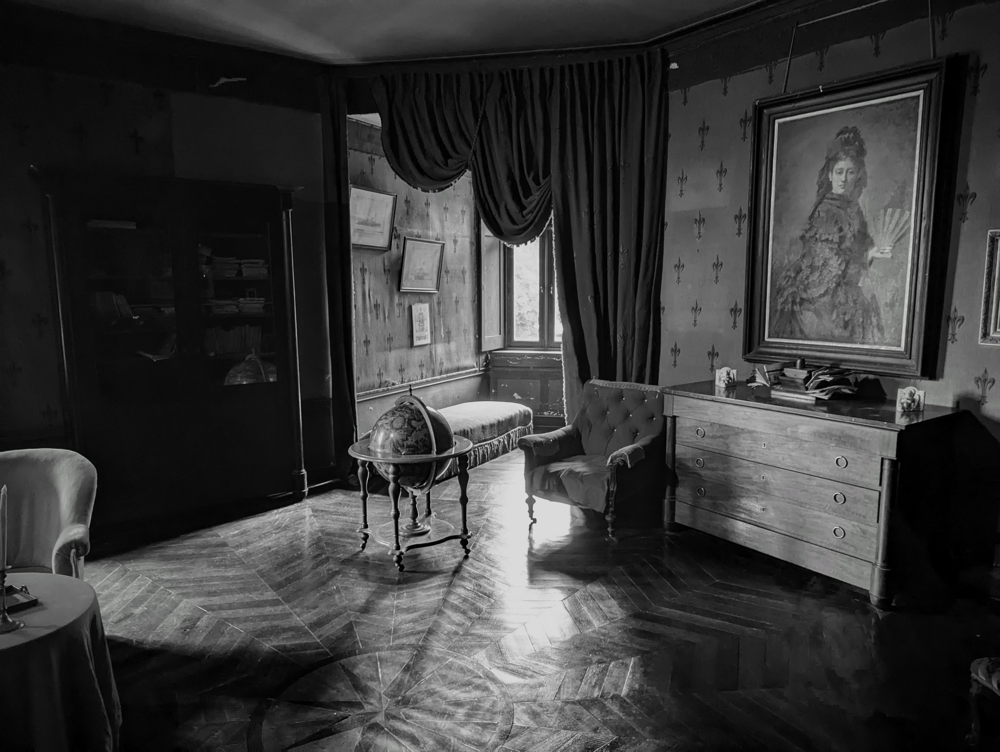

## The Netizen's Way

**Say what you mean**; because telepathy is still in beta testing.

**Be choosy with your media**, because your brain thinks it’s real. Unless, of course, you’re watching someone paint happy little trees.

**Speak clearly, listen carefully, pay close attention**; otherwise, you’ll end up in a conversation about quantum physics when you just asked for the time.

**Do what you love**; life’s too short not to ply your craft. Just don’t expect it to pay the bills, unless your craft is printing money.

**Keep it simple**; complex plans involve running, and who’s got the energy for that?

**Start small and build a little at a time**; a mosaic is more beautiful than the finest concrete, and way less likely to get you sued for improper construction.

**Network**; because who else will laugh at your “I’m not a robot” jokes?

**Be who you are**; even a bent wire can carry a great light, especially in a modern art exhibit.

**Build for strength, not just speed**; the hare may have had more Instagram followers, but the tortoise won the race.

**Hack**; just remember, “try it and see” doesn’t apply to skydiving or lion taming.

**Under-promise and over-deliver**; because everyone loves a surprise, especially when it’s not another birthday card.

**Divide and conquer**; because life is essentially a giant game of strategy board games.

**Do one thing well**; remember, unicorns are famous for just one horn.

**Use what you have**; unless it’s a floppy disk, then maybe it’s time to upgrade.

**Use levers, not people**; because people are terrible at being levers, they keep asking for coffee breaks.

**Release early, release often**; otherwise, you’re just hoarding half-baked ideas, and there’s no market for those.

**Distrust all claims for the one true way**; except for pizza, pizza is always the answer.

**Think ahead, but don’t worship your plans**; all things are possible, except maybe skiing through a revolving door.

**Think big: you are the universe**. And like any good universe, remember to occasionally expand beyond your current dimensions — just
without the big bang.

**Abhor violence in all its forms**, even contradicting others. Keep your peace, hold your tongue, and avoid turning into a debate club mascot.

**Practice the Prime Directive**; unless you’re in a sci-fi movie, then totally ignore it.

<hr>

## My Geek Code

  GE d- s:++ a+++ C++++ UL+++ P+ L+++ E+++ W+++ N+++ o+ K+ w— V PS+ PE
f— c+++ Y+ PGP++ t+++ 5- X- R+++ tv++ b++ D-— xkcd G e++++ h– r+++**  

### Translation

| code | meaning |
|------|---------|
| GE | Geek of Engineering. | |
| d- | I’m usually in jeans and a t-shirt. |
| s:++ | I’m of average height, I’m a linebacker candidate. |
| a+++ | age 60 and up (65 atm). |
| C++++ | I’ll be first in line to get the new cybernetic interface installed into my skull. |
| UL50 | I’ve been using *nix, off and on, for about 50 years. |
| P+++ | I’ve earned a living with Perl. |
| L(U)+++ | I use Ubuntu Linux exclusively, mostly command line. |
| E+++ | Emacs is my login shell!! M-x doctor is my psychologist! I use emacs to control my TV and toaster oven! All you vi people don’t know what you’re missing! I read alt.religion.emacs, alt.sex.emacs, and comp.os.emacs. |
| W1.0+++ | I am an original Netizen, first logging on in 1994. |
| N+++ | I live to chat online. |
| K+ | I like Kibo. If you know, you know. |
| w— | Windows is bloatware. |
| V | I’ve used VMS. Meh. |
| PS+ | My whole concept of politics? Nobody has the right to legislate morality. |
| PE | Distrust both government and business. |
| f— | In matters of religion, I distrust all human claims for the one true way. |
| c+++ | I am a cyberpunk all the way, except the music. |
| Y+ | I have an interest and concern in privacy issues, but in reality I am not really all that active or vocal. |
| PGP++ | I have the most recent version and use it when needed. |
| t+++ | Star Trek inspires me. I wonder about about warp field dynamics and the principles behind the transporter. I have owned the TECH manual and the LP record. I speak some Klingon. I wear an IDIC. I still hate the LCARS interface, though: incredibly noisy, and it really sucks. |
| 5 | Babylon 5 is sub-par. |
| X-Files | It’s ok if you like paranoia and conspiracy stories. I don’t. |
| R+++ | I’ve built and run my own dungeons. I have a drawer full of dice of random designs. |
| tv— | Not much on TV anymore, though I sometimes watch it when I’m petting the cat. |
| b++ | I (used to) find the time to get through at least one new book a month. And I will again, when this legacy heritage home renovation is finally done. |
| D— | Dilbert doesn’t speak to me; I’ve tried to stay out of those type situations. |
| xkcd | I check out xkcd from time to time; sometimes it’s really funny. |
| G | I know what the geek code is and even did up this code. |
| e++++ | I am well-educated, mostly by myself, but I did get more than one college degree. |
| h+++ | I live in the woods, on land I own, in a house I own. |
| r+++ | I found my angel, and we’ve been married for decades now. |

<hr>

Lovely. We can hide stuff in the `<details`> element:


## Lists

This is a plain old bulleted list:

* Banana
* Paper boat
* Cucumber
* Rocket

Ordered lists look pretty much as you'd expect:

1. Goals
1. Motivations
    1. Intrinsic
    1. Extrinsic
1. Second-order effects

It's nice to visualize trees.
This is a regular unordered list with a `tree` class:

<ul class="tree"><li><p style="margin: 0;"><strong>/dev/nvme0n1p2</strong></p>

* usr                               
    * local                         
    * share                         
    * libexec                       
    * include                       
    * sbin                          
    * src                           
    * lib64                         
    * lib                           
    * bin                           
    * games                         
        * solitaire
        * snake
        * tic-tac-toe
    * media                         
* media                             
* run                               
* tmp                               

</li></ul>

## Tables

We can use regular tables that automatically adjust to the monospace grid.
They're responsive. 

<table>
<thead>
  <tr>
    <th class="width-min">Name</th>
    <th class="width-auto">Dimensions</th>
    <th class="width-min">Position</th>
  </tr>
</thead>
<tbody>
  <tr>
    <td>Boboli Obelisk</td>
    <td>1.41m &times; 1.41m &times; 4.87m</td>
    <td>43°45'50.78"N 11°15'3.34"E</td>
  </tr>
  <tr>
    <td>Pyramid of Khafre</td>
    <td>215.25m &times; 215.25m &times; 136.4m</td>
    <td>29°58'34"N 31°07'51"E</td>
  </tr>
</tbody>
</table>

Note that only one column is allowed to grow.

## Forms

Here are some buttons:

<nav>
    <button>Reset</button>
    <button>Save</button>
</nav>

And inputs:

<form class="grid">
<label>First name <input type="text" placeholder="Placeholder..." /></label>
<label>Last name <input type="text" placeholder="Text goes here..." /></label>
<label>Age <input type="text" value="30" /></label>
</form>

And radio buttons:

<form class="grid">
<label><input name="radio" type="radio" /> Option #1</label>
<label><input name="radio" type="radio" /> Option #2</label>
<label><input name="radio" type="radio" /> Option #3</label>
</form>

## Grids

Add the `grid` class to a container to divide up the horizontal space evenly for the cells.
Note that it maintains the monospace, so the total width might not be 100%.
Here are six grids with increasing cell count:

<div class="grid"><input readonly value="1" /></div>
<div class="grid"><input readonly value="1" /><input readonly value="2" /></div>
<div class="grid"><input readonly value="1" /><input readonly value="2" /><input readonly value="3" /></div>
<div class="grid"><input readonly value="1" /><input readonly value="2" /><input readonly value="3" /><input readonly value="4" /></div>
<div class="grid"><input readonly value="1" /><input readonly value="2" /><input readonly value="3" /><input readonly value="4" /><input readonly value="5" /></div>
<div class="grid"><input readonly value="1" /><input readonly value="2" /><input readonly value="3" /><input readonly value="4" /><input readonly value="5" /><input readonly value="6" /></div>

If we want one cell to fill the remainder, we set `flex-grow: 1;` for that particular cell.

<div class="grid"><input readonly value="1" /><input readonly value="2" /><input readonly value="3!" style="flex-grow: 1;" /><input readonly value="4" /><input readonly value="5" /><input readonly value="6" /></div>

## ASCII Drawings

We can draw in `<pre>` tags using [box-drawing characters](https://en.wikipedia.org/wiki/Box-drawing_characters):

```
╭─────────────────╮
│ MONOSPACE ROCKS │
╰─────────────────╯
```

To have it stand out a bit more, we can wrap it in a `<figure>` tag, and why not also add a `<figcaption>`.

<figure>
<pre>
┌───────┐ ┌───────┐ ┌───────┐
│Actor 1│ │Actor 2│ │Actor 3│
└───┬───┘ └───┬───┘ └───┬───┘
    │         │         │    
    │         │  msg 1  │    
    │         │────────►│    
    │         │         │    
    │  msg 2  │         │    
    │────────►│         │    
┌───┴───┐ ┌───┴───┐ ┌───┴───┐
│Actor 1│ │Actor 2│ │Actor 3│
└───────┘ └───────┘ └───────┘</pre>
<figcaption>Example: Message passing.</figcaption>
</figure>

Let's go wild and draw a chart!

<figure><pre>
                      Things I Have
                                              
    │                                     ████ Usable
15  │
    │                                     ░░░░ Broken
    │
12  │             ░            
    │             ░            
    │   ░         ░              
 9  │   ░         ░              
    │   ░         ░              
    │   ░         ░                    ░
 6  │   █         ░         ░          ░
    │   █         ░         ░          ░
    │   █         ░         █          ░
 3  │   █         █         █          ░
    │   █         █         █          ░
    │   █         █         █          ░
 0  └───▀─────────▀─────────▀──────────▀─────────────
      Socks     Jeans     Shirts   USB Drives
</pre></figure>

## Media

Media objects are supported, like images and video:



.webm/11)](https://upload.wikimedia.org/wikipedia/commons/e/e0/The_Center_of_the_Web_%281914%29.webm)

They extend to the width of the page, and add appropriate padding in the bottom to maintain the monospace grid.

## Discussion

That's it for now.
I've very much enjoyed making this, pushing my CSS chops and having a lot of fun with the design.
If you like it or even decide to use it, please [let me know](https://x.com/owickstrom).

The full source code is here: [github.com/owickstrom/the-monospace-web](https://github.com/owickstrom/the-monospace-web)

Finally, a massive shout-out to [U.S. Graphics Company](https://x.com/usgraphics) for all the inspiration.

UNIX is a registered trademark
of The Open Group